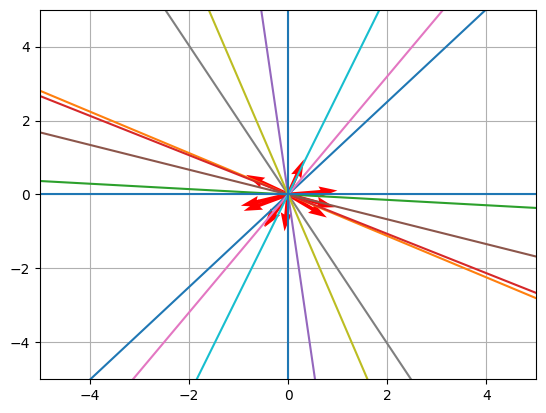
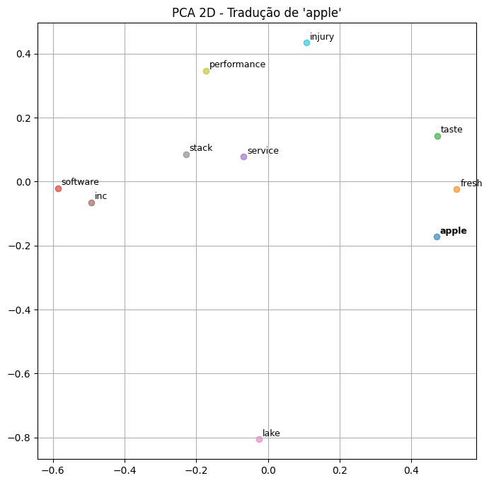
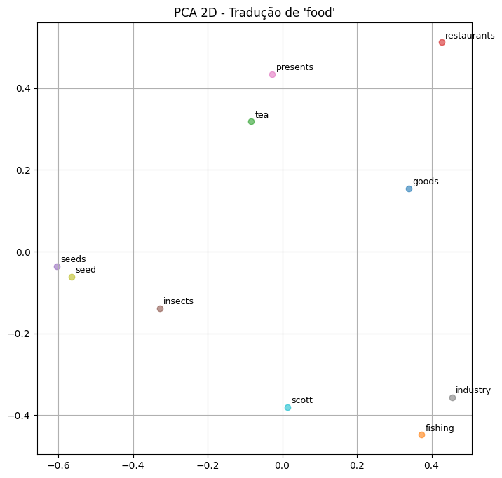
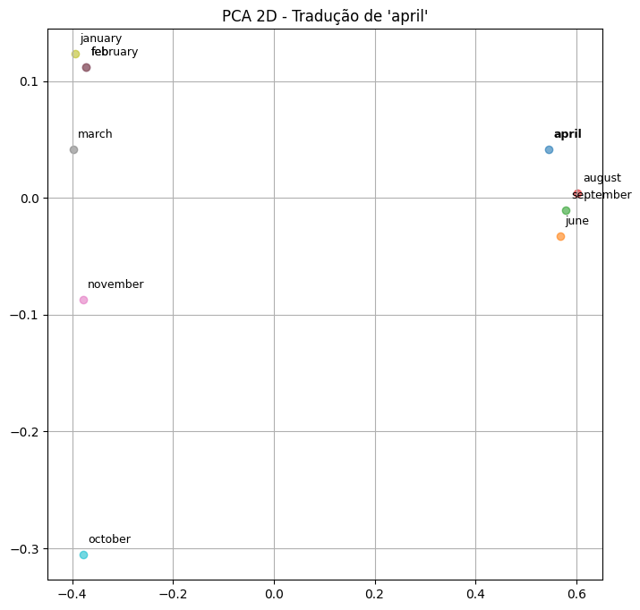

# Tradutor de Inglês para Russo com Embeddings, Procrustes e LSH

Este projeto apresenta a implementação  de um **Tradutor Vetorial de Inglês para Russo**
utilizando **Word Embeddings**, **Alinhamento Ortogonal (Procrustes)**,
**Locality Sensitive Hashing (LSH)** e **Busca KNN Aproximada com Múltiplas Tabelas**.

Todo o processo foi desenvolvido do zero, incluindo:

- Geração de hiperplanos aleatórios
- Implementação manual de hashing sensível à localidade
- Construção de múltiplas tabelas hash
- Aprendizado da matriz de transformação com Procrustes
- Busca aproximada com KNN
- Avaliação por similaridade de cosseno

O objetivo é mapear um embedding em inglês para o espaço vetorial russo e
encontrar as palavras semanticamente mais próximas, utilizando do conceito de uma matriz de transformação.

------------------------------------------------------------------------

## Instalação

Clone o repositório:

git clone https://github.com/TarikSalles/english-russian-embedding-translator

Instale as dependências:

pip install -r requirements.txt

------------------------------------------------------------------------

## Dataset

Foram utilizados:

- Embeddings alinhados do FastText de 300 dimensões
- Dicionário bilíngue

Foram carregadas as **200.000 primeiras palavras** de cada idioma,
das quais **5000 pares válidos** foram utilizados para treinamento.

------------------------------------------------------------------------

## Representação Vetorial

Cada palavra é representada por um vetor de 300 dimensões.

Os vetores são normalizados para que a similaridade de cosseno
represente apenas a direção no espaço vetorial.

similaridade_cosseno(a, b) = a · b

------------------------------------------------------------------------

## Locality Sensitive Hashing (LSH)

Foram implementados hiperplanos aleatórios para dividir o espaço vetorial
em regiões (buckets).

Cada plano define um bit do hash:

hash_i = 1 se (plano · vetor) ≥ 0

O valor hash final é obtido combinando os bits.

Foram utilizadas:

- 10 dimensões por tabela
- 30 tabelas hash independentes

------------------------------------------------------------------------

## Aprendizado da Matriz de Transformação

Desejamos aprender uma matriz W tal que:

XW ≈ Y

Onde:

- X: embeddings em inglês
- Y: embeddings em russo

Foi utilizado o método de **Procrustes Ortogonal**:

1. Centralização
2. Normalização
3. Cálculo de M = XᵀY
4. SVD: UΣVᵀ
5. W = UVᵀ

Essa matriz realiza uma rotação entre os espaços vetoriais, e ignora outros tipos de transformação vetorial.

------------------------------------------------------------------------

## Busca Aproximada (ANN)

Após mapear um vetor inglês:

v_ru_pred = v_en W

A busca é realizada apenas nos buckets correspondentes nas múltiplas tabelas hash. Por isso é considerado uma busca aproximada, e não KNN.

------------------------------------------------------------------------

## Resultados
 
Foram obtidos resultados interessantes que mostraram que diversas palavras e associações foram aprendidas com sucesso mesmo com o limitante de 5000 palavras. 

Exemplo para "april":

- Tradução real: апреля
- Similaridade: ~0.80

Exemplo para "night":

- Tradução real: ночное
- Similaridade: ~0.59

Observou-se que o modelo aprende agrupamentos semânticos,
como meses do ano ficando próximos no espaço vetorial. Ou a palavra comida ficando perto de palavras como "restaurante" e "pesca".

------------------------------------------------------------------------

## Visualização com PCA

Para fins de análise, foi aplicado PCA para projetar os embeddings em 2D.

Isso permitiu visualizar:

- Vetor previsto
- Vetor real
- Top-k palavras mais similares

Os gráficos mostram que palavras semanticamente relacionadas
ficam agrupadas no espaço reduzido.

------------------------------------------------------------------------

## Tecnologias Utilizadas

- Python
- NumPy
- Gensim
- FastText
- Scikit-learn
- Matplotlib
- NLTK
- Jupyter Notebook

------------------------------------------------------------------------
